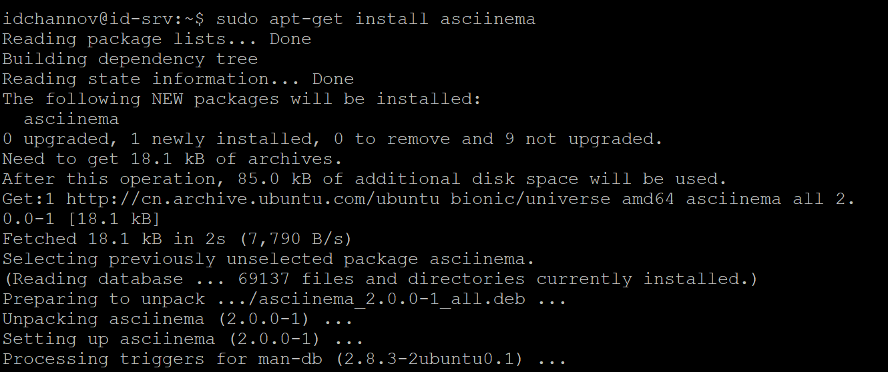
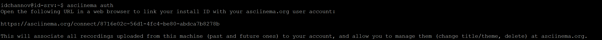

#  Chapter 2 (Experiment)From GUI to CLI

### 1. 实验环境

- Ubuntu 18.04.4 Server 64bit
- asciinema

### 2. 实验要求

- 在asciinema注册一个账号，并在本地安装配置好asciinema
- 完成vimtutor任务并录屏
- 自查清单

### 3. 实验过程

- #### 关于**asciinema**

  - 安装asciinema：`sudo apt-get install asciinema`

    

  - 关联本地帐号与在线账号：`asciinema auth`

    

  - **用法**

    - 记录终端会话：`asciinema rec [filename]`
    - 结束终端会话的录制：`CTRL`+`D`或键入 `exit`
    - 播放录制内容：
      1. 从本地文件播放：`asciinema play /path/to/asciicast.cast`
      2. 从HTTP（S）URL播放：`asciinema play https://asciinema.org/a/video_name.cast`
    - 将录制内容上传到asciinema服务器：`asciinema upload <filename>`
    - 将安装ID与asciinema.org用户帐户相关联：`asciinema auth`
    - 将录制输出打印到终端：`asciinema cat <filename>`
  
- #### vimtutor 学习记录

  - [Lesson1](https://asciinema.org/a/cc1WMBONksaeXHfJU2y5GuCM2)
  - [Lesson2](https://asciinema.org/a/5EDbuAde3VsrHEIo8H0X3C22h)
  - [Lesson3]( https://asciinema.org/a/y3IMKiBOPWwsmNM3IcLDGgmj9)
  - [Lesson4]( https://asciinema.org/a/jEZuw4kNm2qXqjiv0ZA7Pjs1A)
  - [Lesson5]( https://asciinema.org/a/gkZzx0oJrAZvoLdjKbnAjOTnF)
  - [Lesson6]( https://asciinema.org/a/0ElIuz9PmI7hPy6FgzwHATezv)
  - [Lesson7](https://asciinema.org/a/BAc99RbBvS6UAHS7IsdmLeoUT)（复制样例的时候出了点小问题，所以看起来有点破破烂烂w...）

### 4. 自查清单

- 你了解vim有哪几种工作模式？

  答：Normal, Insert, Replace, Visual, Compatible

- Normal模式下，从当前行开始，一次向下移动光标10行的操作方法？如何快速移动到文件开始行和结束行？如何快速跳转到文件中的第N行？

  - 光标移动10行：键入`10j`

  - 移动到文件开始行：键入`gg`；移动到文件结束行：键入`G`
  - 快速跳转：键入`NG`/`Ngg`

- Normal模式下，如何删除单个字符、单个单词、从当前光标位置一直删除到行尾、单行、当前行开始向下数N行？

  - 删除单个字符：将光标移动至所需要删除的字符上再键入`x`
  - 删除单个单词：将光标移动至单词开头再键入`dw`
  - 从当前光标一直删除到行尾：键入`d$`
  - 删除单行：将光标移动至行首再键入`dd`
  - 删除当前行向下数的N行：键入`Ndd`

- 如何在vim中快速插入N个空行？如何在vim中快速输入80个-？

  - 键入`No`/`NO`+`ESC`
  - 键入`80i-`

- 如何撤销最近一次编辑操作？如何重做最近一次被撤销的操作？

  - 键入`u`
  - 键入`CTRL`+`R`

- vim中如何实现剪切粘贴单个字符？单个单词？单行？如何实现相似的复制粘贴操作呢？

  - 剪切粘贴操作：键入`v`/`V`选中目标文本,键入`y`进行复制，将光标移动至需要粘贴的地方键入`p`
  - 相似的复制粘贴操作：一次复制之后可以进行多次粘贴操作（与GUI相似）

- 为了编辑一段文本你能想到哪几种操作方式（按键序列）？

  - `vim FILENAME`从shell提示符下启动vim

  - `h` , `j`,  `k`,  `l` ---> 方向键，移动光标

    `Nw`, `Ne` ---> 快速移动光标

  - `i` ---> 开始编辑文本

    `ce`, `c$`, `a`/`A` , `o`/`O`---> 有关文本开始变更的位置

    `x`, `dNw`, `d$`, `dd`  ---> 文本删除

    `rx`, `R` ---> 文本更改

  - `ESC` ---> 还原至Normal模式

    `:q[!]`, `:x` ---> 退出编辑界面

    `wq` --->保存编辑内容并退出

  - `:e` ---> 开始编辑新的文本
  - `:w` ---> 保存编辑内容

- 查看当前正在编辑的文件名的方法？查看当前光标所在行的行号的方法？

  ​	键入`CTRL`+`G`

- 在文件中进行关键词搜索你会哪些方法？如何设置忽略大小写的情况下进行匹配搜索？如何将匹配的搜索结果进行高亮显示？如何对匹配到的关键词进行批量替换？

  - 关键词搜索：键入`/key_word`或`?key_word`
  - 忽略大小写：键入`:set ic`; 取消忽略大小写：`:set noic`
  - 高亮显示：键入`:set hls`

  - 对匹配到的关键词进行批量替换：
    - `s/old/new/g`：全文批量替换
    - `#,#s/old/new/g`：在某两行之间批量替换
    - `%s/old/new/gc`：标中全部按键替换

- 在文件中最近编辑过的位置来回快速跳转的方法？

  - 返回上一次编辑的位置：`CTRL`+`i`
  - 返回最近一次编辑的位置：`CTRL`+`o`

- 如何把光标定位到各种括号的匹配项？例如：找到(, [, or {对应匹配的),], or }

  ​	移动光标至某一括号上，键入`%`

- 在不退出vim的情况下执行一个外部程序的方法？

  ​	键入`!`+external command

- 如何使用vim的内置帮助系统来查询一个内置默认快捷键的使用方法？如何在两个不同的分屏窗口中移动光标？

  - 键入`:help key`
  - 键入`CTRL`+`w` `CTRL`+`w`

​    

​    

