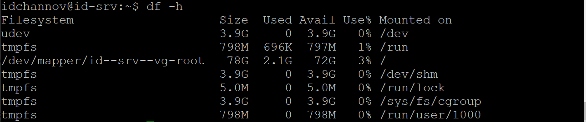
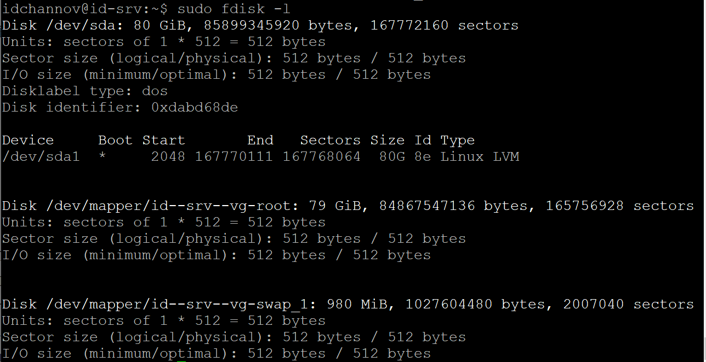
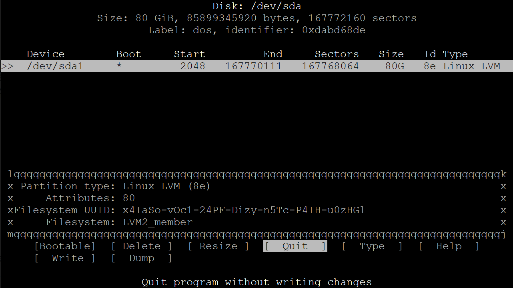
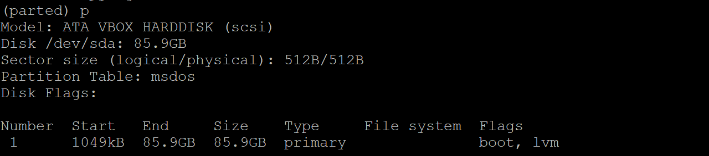
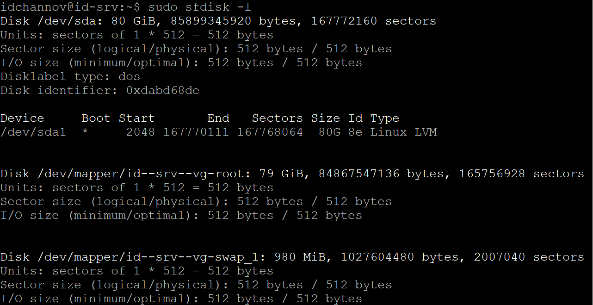
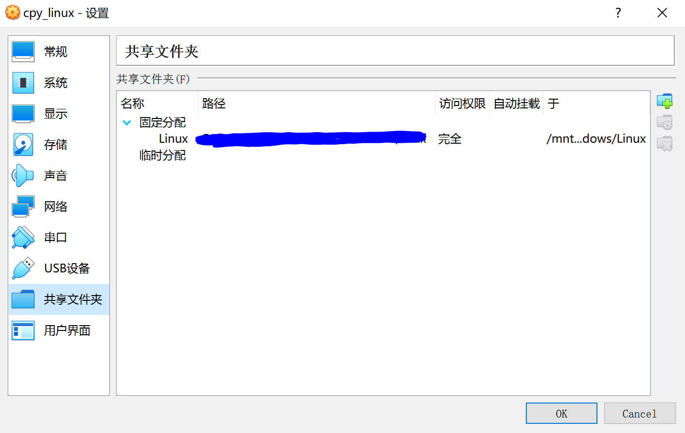

# Chapter 3 (Experiment) About Systemd

### 1. 实验环境

- Ubuntu 18.04.4 Server 64bit
- PuTTY

### 2. 实验要求

- 阅读阮一峰的「Systemd 入门教程：命令篇」与「Systemd 入门教程：实战篇」并进行动手实操
- 按照入门教程的章节划分分段录屏上传到asciinema，并按照见名知意的标准编辑录像文件名
- 完成课后自查清单

### 3. 实验过程

- 软件包安装

  - `util-linux`
  - `virtualbox-guest-dkms`

- **「Systemd 入门教程：命令篇」**

  - [系统管理](https://asciinema.org/a/xPBncXeLSdBQILU8TwRa2L9ae)

    - 运行失败的指令

      ```shell
      $ sudo timedatectl set-time YYYY-MM-DD
      $ sudo timedatectl set-time HH:MM:SS
      ```

    - 失败原因  系统根据时区自动调整时间

  - [Unit](https://asciinema.org/a/XpxmRGA4AkFG0ooVUsHr2Vh77)

  - [Unit的配置文件](https://asciinema.org/a/IZKKfqplbw0oa52GgkMPyZVpK)

  - [Target](https://asciinema.org/a/ma0GGbN8HzHqVwt03ha8AkWB8)

  - [日志管理](https://asciinema.org/a/pCtHtiY1JiIk2tMHiQoe16edT)

    - 运行失败的指令

      ```shell
      $ sudo journalctl /usr/lib/systemd/systemd
      $ sudo journalctl /usr/bin/bash
      ```

    - 失败原因  不存在该路径(?)

      ​                  *注：已确认该路径有效，文件存在，不太清楚为什么指令运行不成功*

- **「Systemd 入门教程：实战篇」**

  - 服务的[开机启动/启动/停止](https://asciinema.org/a/wLO8PjZEZA9Cp8IKiupKxYkNz)

    - 服务状态含义解读

      ```shell
      idchannov@id-srv:~$ sudo systemctl status apache2
      ● apache2.service - The Apache HTTP Server
         Loaded: loaded (/lib/systemd/system/apache2.service; enabled; vendor preset:
        Drop-In: /lib/systemd/system/apache2.service.d
                 └─apache2-systemd.conf
         Active: active (running) since Wed 2020-04-15 13:16:47 +06; 2s ago
        Process: 3020 ExecStop=/usr/sbin/apachectl stop (code=exited, status=0/SUCCESS
        Process: 3041 ExecStart=/usr/sbin/apachectl start (code=exited, status=0/SUCCE
       Main PID: 3055 (apache2)
          Tasks: 55 (limit: 4915)
         CGroup: /system.slice/apache2.service
                 ├─3055 /usr/sbin/apache2 -k start
                 ├─3056 /usr/sbin/apache2 -k start
                 └─3057 /usr/sbin/apache2 -k start
      
      Apr 15 13:16:47 id-srv systemd[1]: Starting The Apache HTTP Server...
      Apr 15 13:16:47 id-srv apachectl[3041]: AH00558: apache2: Could not reliably det
      Apr 15 13:16:47 id-srv systemd[1]: Started The Apache HTTP Server.
      ```

      ①`Loaded`行：apache2配置文件的位置为`/lib/systemd/system/apache2.service`；`enabled`表明apache2已设为开机自启动

      ②`Active`行：`active`表明正在运行，`inactive`表明没有运行，`Wed 2020-04-15 13:16:47 +06`为开始运行的时间

      ③`Process`行：之前的运行状态

      ④`Main PID`行：主进程ID

      ⑤`CGroup`块：所有的子进程

      ⑥日志块：运行日志

  - 读懂配置文件

    - `apache2.service`配置文件解读

      ```shell
      idchannov@id-srv:~$ systemctl cat apache2.service
      # /lib/systemd/system/apache2.service
      [Unit]
      Description=The Apache HTTP Server
      After=network.target remote-fs.target nss-lookup.target
      
      [Service]
      Type=forking
      Environment=APACHE_STARTED_BY_SYSTEMD=true
      ExecStart=/usr/sbin/apachectl start
      ExecStop=/usr/sbin/apachectl stop
      ExecReload=/usr/sbin/apachectl graceful
      PrivateTmp=true
      Restart=on-abort
      
      [Install]
      WantedBy=multi-user.target
      
      # /lib/systemd/system/apache2.service.d/apache2-systemd.conf
      [Service]
      Type=forking
      RemainAfterExit=no
      ```

      ①Unit区块：

      ​	`Description`字段：关于apache2服务的简单描述

      ​	`After`字段：表示如果`network.target`,`remote-fs.target`或`nss-lookup.target`需要启动，那么`apache2.service`应该在他们之后启动

      ②Service区块：

      ​	`Type`字段：apache2的启动类型为forking，即`ExecStart`字段将以`fork()`方式启动，此时父进程将会退出，子进程将成为主进程

      ​	`ExecStart`字段：定义启动进程时执行的命令

      ​	`ExecStop`字段：定义停止服务时执行的命令

      ​	`ExecReload`字段：定义重启服务时执行的命令

      ​	`Restart`字段：apache2退出以后的重启方式为`on-abort`，即只有在收到没有捕捉到的信号终止时，才会重启

      ​	`PrivateTmp`字段：True表示给服务分配独立的临时空间

      ③Install区块：

      ​	`WantedBy`字段：`apache2.service`所在的Target为`multi-user.target`

    - Target配置文件解读

      ```shell
      idchannov@id-srv:~$ systemctl cat multi-user.target
      # /lib/systemd/system/multi-user.target
      [Unit]
      Description=Multi-User System
      Documentation=man:systemd.special(7)
      Requires=basic.target
      Conflicts=rescue.service rescue.target
      After=basic.target rescue.service rescue.target
      AllowIsolate=yes
      ```

      ①`Description`字段：关于Target的简单描述

      ②`Documentation`字段：Target配置文件的文档位置

      ③`Requires`字段：要求`basic.target`一起运行

      ④`Conflicts`字段：如果`rescue.service`或`rescue.target`正在运行，`multi-user.target`就不能运行

      ⑤`After`字段：`multi-user.target`在`basic.target`,`rescue.service`与`rescue.target`之后运行

      ⑥`AllowIsolate`字段：允许使用`systemctl isolate`命令切换到`multi-user.target`

### 4. 自查清单

- 如何添加一个用户并使其具备sudo执行程序的权限？

  答：方法一：

  ​		① ` adduser xxx`    -->  添加用户

  ​	    ②`sudo usermod -a -G xxx adm `    -->  添加用户组

  ​        或`sudo usermod -a -g xxx 4`

  ​		方法二：

  ​		`adduser xxx --ingroup adm `

  ​        或 `adduser xxx --gid 4`

- 如何将一个用户添加到一个用户组？

  答：`sudo usermod -a -G xxx group_name`

  ​    或`sudo usermod -a -g xxx group_gid`

- 如何查看当前系统的分区表和文件系统详细信息？

  答：

  - 查看分区表与文件系统的详细信息
    1. `df -h`
    2. `sudo fdisk -l`
    3. `sudo cfdisk -L | -z`(此处展示的是option为-L的情形)
    4. `parted` + `(parted)p`
    5. `sudo sfdisk -l`
    6. `sudo partx -s disk`
    7. `cat /proc/partitions`
  - 不同查看方式的评测：本人为Linux小白一枚，对各种查看方式的具体用途不是很清楚，查阅完相关资料      以后发现老师上课推荐的方法并非最优，就个人体验来说来说`cfdisk`更好一些，，操作简便，可视化程度更高，而且它还可以进行磁盘分区，虽然parted也可以进行磁盘分区，但需要交互式键入指令，略麻烦。

- 如何实现开机自动挂载Virtualbox的共享目录分区？

  答：

  - 步骤

    1. 安装增强功能

       ```shell
       root@id-srv:/home/idchannov# mount /dev/cdrom /media/cdrom
       root@id-srv:/home/idchannov# cd /media/cdrom
       root@id-srv:/media/cdrom# ./VBoxLinuxAdditions.run
       ```

    2. 虚拟机设置 --> 共享文件夹 --> 添加共享文件夹（固定分配+挂载点）

    3. 在虚拟机的/mnt目录下新建一个共享文件的挂载目录，并在该目录下再次新建目录用于挂载实际 的共享目录 

       ```shell
       root@id-srv:/home/idchannov# cd /mnt/
       root@id-srv:/mnt# mkdir windows share
       root@id-srv:/mnt# cd windows
       root@id-srv:/mnt/windows# mkdir Linux
       ```

    4. 挂载共享文件

       `sudo mount -t vboxsf shared_file aimed_path`

    5. 实现开机自动挂载：在文件 /etc/rc.local 中追加如下命令

       `sudo mount -t vboxsf shared_file aimed_path`

  - 实验结果展示（此处挂载的是github的本地代码仓库）

    

- 基于LVM（逻辑分卷管理）的分区如何实现动态扩容和缩减容量？

  答：扩容：`lvextend -l [+]Number[PERCENT]/-L [+]Size[m|UNIT] position_args`

  ​		缩减：`lvreduce -L|--size [-]Size[m|UNIT] LV`

- 如何通过systemd设置实现在网络连通时运行一个指定脚本，在网络断开时运行另一个脚本？

  答：

  网络服务脚本配置：

  ```shell
  [Service]
  ...
  ExecStart=<path_service1> start
  ExecStop=<path_service2> stop
  ...
  ```

- 如何通过systemd设置实现一个脚本在任何情况下被杀死之后会立即重新启动？实现**杀不死**？

  答：
  
  服务脚本配置：
  
  ```shell
  [Service]
  ...
  Restart=always
  ...
  ```

### 5. 参考资料

- [「Systemd 入门教程：命令篇」by 阮一峰的网络日志](http://www.ruanyifeng.com/blog/2016/03/systemd-tutorial-commands.html)
- [「Systemd 入门教程：实战篇」by 阮一峰的网络日志](http://www.ruanyifeng.com/blog/2016/03/systemd-tutorial-part-two.html)
- [Linux 查看磁盘分区、文件系统、使用情况的命令和相关工具介绍 by CSDN博主「a746742897」](https://blog.csdn.net/a746742897/article/details/52689271)

- [Linux系统与网络管理 第三章 Linux 服务器系统管理基础 1/2 by bilibili up主 黄药师漫步桃花岛]( https://www.bilibili.com/video/av86370350)
- [Linux系统与网络管理 第三章 Linux 服务器系统管理基础 2/2 by bilibili up主 黄药师漫步桃花岛](https://www.bilibili.com/video/av86370626)
- [VirtualBox 共享文件夹设置 及 开机自动挂载](https://yq.aliyun.com/articles/413223)