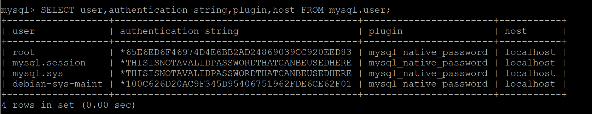
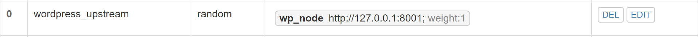
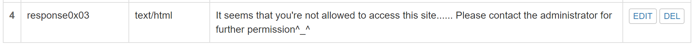

# Chapter 5 Web服务器

### 1. 实验环境

- Ubuntu 18.04.4 Server 64bit
- PuTTY

### 2. 软件环境配置

- **Nginx**

  - 安装依赖包

    ```cmd
  	idchannov@id-srv:~$ sudo apt install curl gnupg2 ca-certificates lsb-release
    ```

  - 为稳定的Nginx软件包设置apt库

    ```cmd
    idchannov@id-srv:~$ echo "deb http://nginx.org/packages/ubuntu `lsb_release -cs` nginx" \
        | sudo tee /etc/apt/sources.list.d/nginx.list
    ```

  - 导入官方的Nginx签名密钥以便apt验证软件包的真实性

    ```cmd
    idchannov@id-srv:~$ curl -fsSL https://nginx.org/keys/nginx_signing.key | sudo apt-key add -
    ```

  - 验证导入的密钥是否正确    

    ```cmd
    idchannov@id-srv:~$ sudo apt-key fingerprint ABF5BD827BD9BF62
    ```

  - 安装Nginx

    ```cmd
    idchannov@id-srv:~$ sudo apt update
    idchannov@id-srv:~$ sudo apt install nginx
    ```

  - 试运行Nginx 

    ```cmd
    idchannov@id-srv:~$ sudo systemctl start nginx
    ```

  - Windows主机环境下访问Host-Only ip地址

    

- **VeryNginx**
  
  - clone[官方代码仓库](https://github.com/alexazhou/VeryNginx.git)到本地
  
    ```cmd
    idchannov@id-srv:~$ git clone https://github.com/alexazhou/VeryNginx.git
    ```
  
  - 安装依赖软件包
  
    ```cmd
    idchannov@id-srv:~$ sudo apt-get install python libpcre3-dev libssl-dev zlib1g-dev
    ```
    
  - 进入仓库目录 
  
    ```cmd
    idchannov@id-srv:~$ cd VeryNginx/
    ```
  
  - 安装VeryNginx  
  
    ```cmd
    idchannov@id-srv:~$ sudo python install.py install
    ```
  
  - 配置信息修改 
  
    ```cmd
    idchannov@id-srv:~$ vim /opt/verynginx/openresty/nginx/conf/nginx.conf
    ```
  
    ```shell
    user	www-data;
    server {
    		listen 8005;
      }
    ```
  
  - 试运行VeryNginx
  
    ```cmd
    idchannov@id-srv:~$ /opt/verynginx/openresty/nginx/sbin/nginx
    ```
  
  - Windows主机环境下访问Host-Only ip地址
  
    
  
- **WorldPress 4.7**

  注：这里为测试软件配置选用了非localhost的ip进行安装，非必要步骤，建议在安装时直接配置为localhost以避免后续的数据库清洗。

  - 安装准备

    - 安装LEMP(**L**inux-**E**ngine/Nginx-**M**ySQL-**P**HP)堆栈

      1. 安装MySQL以管理站点数据

         - 安装软件包

           ```cmd
           idchannov@id-srv:~$ sudo apt-get install mysql-server
           ```

         - 完善MySQL相关配置 

           ```cmd
           idchannov@id-srv:~$ sudo mysql_secure_installation
           ```

           【配置选择】使用`auth_socket`身份验证插件(n)、删除匿名用户(y)、禁用远程root登录(y)、删除测试数据库并重新加载配置(y)

         - 将root的身份验证方法从`auth_socket`切换为`mysql_native_password`

           ```cmd
           # 从终端打开MySQL提示符
           idchannov@id-srv:~$ sudo mysql
           # 检查每个MySQL用户帐户使用的身份验证方法
           mysql> SELECT user,authentication_string,plugin,host FROM mysql.user;
           # 将root帐户配置为使用密码进行身份验证
           mysql> ALTER USER 'root'@'localhost' IDENTIFIED WITH mysql_native_password BY 'password';
           # 重新加载授权表并使新的更改生效
           mysql> FLUSH PRIVILEGES;
           # 退出
           mysql> exit;
           ```

           

         - 试运行数据库系统    `sudo mysql -u root -p`并键入root用户密码

           

      2. 安装PHP并配置Nginx以使用PHP处理器

         - 安装fastCGI进程管理器(php-fpm)以及一个附加的帮助程序包

           ```cmd
           idchannov@id-srv:~$ sudo apt install php-fpm php-mysql
           ```

         - 编辑一个新的服务器块配置文件

           ```cmd
           # 编辑配置文件
           idchannov@id-srv:~$ sudo vim /etc/nginx/sites-available/wp.sec.cuc.edu.cn
           # 创建软连接
           idchannov@id-srv:~$ sudo ln -s /etc/nginx/sites-available/wp.sec.cuc.edu.cn /etc/nginx/sites-enabled/
           ```

           配置文件内容：

           ```shell
           server {
                   listen 8001;
            		root /var/www/wordpress;
                   index index.php index.html index.htm index.nginx-debian.html;
                   server_name wp.sec.cuc.edu.cn;
                   location / {
                           try_files $uri $uri/ =404;
                   }
                   location ~ \.php$ {
                           include snippets/fastcgi-php.conf;
                           fastcgi_pass unix:/var/run/php/php7.2-fpm.sock;
                   }
           }
           ```

         - 从`/sites-enabled/`目录取消链接默认配置文件

           ```cmd
           idchannov@id-srv:~$ sudo unlink /etc/nginx/sites-enabled/default
           ```

         - 测试新配置文件的语法错误

           ```cmd
           idchannov@id-srv:~$ sudo nginx -t
           ```

         - 重新加载Nginx进行必要的更改

           ```cmd
           idchannov@id-srv:~$ sudo systemctl reload nginx
           ```

  - 安装WordPress

    - 为WordPress创建MySQL数据库和用户

      ```cmd
      # 从终端打开MySQL提示符
      idchannov@id-srv:~$ mysql -u root -p
      # 创建一个可由WordPress控制的独立数据库,数据库名称为wordpress
      mysql> CREATE DATABASE wordpress DEFAULT CHARACTER SET utf8 COLLATE utf8_unicode_ci;
      # 创建一个单独的MySQL用户帐户，该帐户将专用于wordpress数据库
      mysql> GRANT ALL ON wordpress.* TO 'wordpressuser'@'localhost' IDENTIFIED BY 'password';
      # 重新加载授权表并使新的更改生效
      mysql> FLUSH PRIVILEGES;
      # 退出MySQL
      mysql> exit;
      idchannov@id-srv:~$ sudo systemctl restart mysql
      ```

    - 安装其他PHP扩展

      ```cmd
      idchannov@id-srv:~$ sudo apt-get update
      # 安装一些最流行的PHP扩展以用于WordPress
      idchannov@id-srv:~$ sudo apt-get install php-curl php-gd php-intl php-mbstring php-soap php-xml php-xmlrpc php-zip
      # 重新启动PHP-FPM进程，以便运行中的PHP处理器可以利用新安装的功能
      idchannov@id-srv:~$ sudo systemctl restart php7.2-fpm
      ```

    - 配置Nginx

      ```cmd
      # 编辑配置文件
      idchannov@id-srv:~$ sudo vim /etc/nginx/sites-available/wp.sec.cuc.edu.cn
      # 检查配置中的语法错误
      idchannov@id-srv:~$ sudo nginx -t
      # 重新加载Nginx
      idchannov@id-srv:~$ sudo systemctl reload nginx
      ```

      配置文件修改内容：

      ```shell
      server {
          . . .
          # add
          location / {
              #try_files $uri $uri/ =404;
              try_files $uri $uri/ /index.php$is_args$args;
          }
          location = /favicon.ico { log_not_found off; access_log off; }
          location = /robots.txt { log_not_found off; access_log off; allow all; }
          location ~* \.(css|gif|ico|jpeg|jpg|js|png)$ {
              expires max;
              log_not_found off;
          }
          . . .
      }
      ```

    - 将`/var/www/wordpress`用作WordPress安装的根目录

      ```cmd
      # 切换文件夹
      idchannov@id-srv:~$ cd /var/www/
      # 创建文件夹wordpress用于WordPress的安装
      idchannov@id-srv:/var/www$ sudo mkdir wordpress
      # 复制WordPress-4.7目录下的文件到/var/www/wordpress，使用-a确保权限得到维护
      idchannov@id-srv:~$ sudo cp -a /home/idchannov/WordPress-4.7/. /var/www/wordpress
      # 将示例配置文件复制到WordPress实际读取的文件名下
      idchannov@id-srv:~$ sudo cp /var/www/wordpress/wp-config-sample.php /var/www/wordpress/wp-config.php
      # 将所有权分配给www-data用户和组
      idchannov@id-srv:~$ sudo chown -R www-data:www-data /var/www/wordpress
      ```

      

    - 设置WordPress配置文件

      ```cmd
      # 从WordPress密钥生成器获取安全值
      idchannov@id-srv:~$ curl -s https://api.wordpress.org/secret-key/1.1/salt/
      # 修改配置文件
      idchannov@id-srv:~$ sudo vim /var/www/wordpress/wp-config.php
      idchannov@id-srv:~$ sudo systemctl restart mysql
      ```

      配置文件修改：

      ```shell
      define('DB_NAME', 'wordpress');
      define('DB_USER', 'wordpressuser');
      define('DB_PASSWORD', key);
      
      ... ...
      # add
      define('FS_METHOD', 'direct');
      
      ... ...
      
      define('AUTH_KEY',         'R_2]2wTaTvItjk-L&S8zp5h~>=j,h9+|Kz:JDRpeQ|7f4o|!&0?xm5o4$^1O/Z-|');
      define('SECURE_AUTH_KEY',  'i)6Tx{=|*)z0n!+UiL/F^}-WM$!W*=up7)DB/@/!}PaI7U*wvt>007at_bF=AW@!');
      define('LOGGED_IN_KEY',    '8<V;F1#;-Ev9xN{ko4|+Q3!-U15Q;*c0F+mw+|-/*7-btLo-$Y4qBzk~q!,=4d3]');
      define('NONCE_KEY',        'vdrzA:r[3te+V;0~drZT(p=1h[dWPoLQ[FT<i}~Z:h1DHx|%8Q~5(VqFj]sYb.-9');
      define('AUTH_SALT',        'r(`ENd6Ftm)j3[c=7:>{^x8O-Gsob ,42+DSdc,8@5.| EzDR=Bxe#dHiVvR)=Y:');
      define('SECURE_AUTH_SALT', '85B8%VB/VvQ1F~}3X9aKyQaA,PjQqD(u<.}n[hg?hHIamQMrP?Lyu[z+#1ih X- ');
      define('LOGGED_IN_SALT',   '0&pN(^vs6m^0H=G|Ij5/+T4g~$~XJWDq{9%k8Qtgc;ad/AP*$D#oV7FDD=3UEAr ');
      define('NONCE_SALT',       'rPq+q2C-_oo<XpinPQ^k$kRqZJkX@=3s|f@(|&*}7E@/|j-CI%=jG33|||+Ahk3:');
      ```

    - 试运行http://wp.sec.cuc.edu.cn:8001/并完成初始化配置
    
      
    
      

- **Damn Vulnerable Web Application**

  注：这里为测试软件配置选用了非localhost的ip进行安装，非必要步骤，建议在安装时直接配置为localhost以避免后续的数据库清洗。

  - 系统更新
  
    ```cmd
    idchannov@id-srv:~$ sudo apt-get update
    idchannov@id-srv:~$ sudo ap-get upgrade
    ```

  - 为DVWA创建MySQL数据库和用户
  
    ```cmd
    # 从终端打开MySQL提示符
    idchannov@id-srv:~$ mysql -u root -p
    # 创建一个可由DVWA控制的独立数据库,数据库名称为dvwa
    mysql> CREATE DATABASE dvwa DEFAULT CHARACTER SET utf8 COLLATE utf8mb4_unicode_ci;
    # 创建一个单独的MySQL用户帐户，该帐户将专用于wordpress数据库
    mysql> GRANT ALL ON dvwa.* TO 'dvwauser'@'localhost' IDENTIFIED BY 'password';
    # 重新加载授权表并使新的更改生效
    mysql> FLUSH PRIVILEGES;
    # 退出MySQL
    mysql> exit;
    idchannov@id-srv:~$ sudo systemctl restart mysql
    ```

  - 安装DVWA
  
    ```cmd
    # 下载DVWA的最新版本
    idchannov@id-srv:~$ git clone https://github.com/ethicalhack3r/DVWA /tmp/DVWA
    # 创建文件夹dvwa用于DVWA的安装
    idchannov@id-srv:~$ sudo mkdir /var/www/dvwa
    # 将软件包移动到dvwa目录下
    idchannov@id-srv:~$ sudo rsync -avP /home/idchannov/DVWA/ /var/www/dvwa/
    # 将示例配置文件复制到DVWA实际读取的文件名下
    idchannov@id-srv:~$ cp /var/www/dvwa/config/config.inc.php.dist /var/www/dvwa/config/config.inc.php
    # 更改配置文件
    idchannov@id-srv:~$ sudo vim /etc/nginx/sites-available/dvwa.sec.cuc.edu.cn
    # 设置软链接
    idchannov@id-srv:~$ sudo ln -s /etc/nginx/sites-available/dvwa.sec.cuc.edu.cn /etc/nginx/sites-enabled/
    # 重载nginx
    idchannov@id-srv:~$ sudo systemctl reload nginx
    ```
  
    配置文件修改：

    ```shell
    server {
        listen 8006;
    	server_name dvwa.sec.cuc.edu.cn;
    
        root /var/www/dvwa/;
        index index.php index.html index.htm index.nginx-debian.html;
    
        location / {
        try_files $uri $uri/ /index.php$is_args$args;
        }
    
        location ~ \.php\$ {
            include snippets/fastcgi-php.conf;
            fastcgi_pass unix:/run/php/php7.2-fpm.sock;
        }
    }
    ```
    
  - 修改PHP的配置文件并更改属主
    
    ```cmd
    idchannov@id-srv:~$ vim /var/www/dvwa/config/config.inc.php
    idchannov@id-srv:~$ vim /etc/php/7.2/fpm/php.ini 
    # 更改文件夹的属主信息
    idchannov@id-srv:~$ sudo chown -R www-data:www-data /var/www/dvwa
    idchannov@id-srv:~$ sudo systemctl restart php7.2-fpm
    ```
    
      配置文件修改内容：
    
    ```shell
    #/var/www/dvwa/config/config.inc.php  
    $_DVWA[ 'db_database' ] = 'dvwa';
    $_DVWA[ 'db_user' ]     = 'dvwauser';
    $_DVWA[ 'db_password' ] = 'dvwa123';
      
    # 从https://www.google.com/recaptcha/admin/create获取  
    $_DVWA[ 'recaptcha_public_key' ]  = public_key;
    $_DVWA[ 'recaptcha_private_key' ] = private_key;
    
    #/etc/php/7.2/fpm/php.ini
    allow_url_include = on
    allow_url_fopen = on
    display_errors = off
    ```
    
  - 访问http://dvwa.sec.cuc.edu.cn:8006/完成初始化配置
  
    - 在如下页面点击`create database`
  
      
  
    - 用`admin/password`实现登入
  
      
  
    - 进入DVWA页面
  
      

### 3. 实验过程

- **基本要求**

  - 在一台主机（虚拟机）上同时配置Nginx和VeryNginx
    - VeryNginx作为本次实验的Web App的反向代理服务器和WAF

    - PHP-FPM进程的反向代理配置在nginx服务器上，VeryNginx服务器不直接配置Web站点服务

      ```cmd
      # 修改配置文件
      idchannov@id-srv:~$ sudo vim /etc/nginx/sites-available/corresponding_dir
      # 重启Nginx
      idchannov@id-srv:~$ sudo systemctl restart nginx
      ```

      配置文件修改：

      ```shell
       location ~ \.php$ {
                      include snippets/fastcgi-php.conf;
                      fastcgi_pass unix:/var/run/php/php7.2-fpm.sock;
              }
      ```

  - 使用Wordpress搭建的站点对外提供访问的地址为：http://wp.sec.cuc.edu.cn

    - 在**Basic**中添加匹配规则

      

    - 在**Backend-Proxy Pass-Up Stream**中添加规则

      

    - 在**Backend-Proxy Pass-Proxy Pass**中添加规则

      

    - 修改WordPress的配置文件

      ```cmd
      idchannov@id-srv:~$ sudo vim /etc/nginx/sites-available/wp.sec.cuc.edu.cn
      ```

      配置文件修改内容：

      ```shell
      server {
              listen localhost:8001;
      		......
      	}
      ```

    - 重启Nginx

      ```cmd
      idchannov@id-srv:~$ sudo systemctl restart nginx
      ```

    - 清洗数据库（按照测试软件配置时的步骤重建即可）

  - 使用Damn Vulnerable Web Application (DVWA)搭建的站点对外提供访问的地址为： http://dvwa.sec.cuc.edu.cn

    - 在**Basic**中添加匹配规则

      

    - 在**Backend-Proxy Pass-Up Stream**中添加规则

      

    - 在**Backend-Proxy Pass-Proxy Pass**中添加规则

      

    - 修改WordPress的配置文件

      ```cmd
      idchannov@id-srv:~$ sudo vim /etc/nginx/sites-available/dvwa.sec.cuc.edu.cn
      ```

      配置文件修改内容：

      ```shell
      server {
              listen localhost:8006;
      		......
      	}
      ```

    - 重启Nginx

      ```cmd
      idchannov@id-srv:~$ sudo systemctl restart nginx
      ```

    - 清洗数据库（按照测试软件配置时的步骤重建即可）

- **安全加固要求**

  - 使用IP地址方式均无法访问上述任意站点，并向访客展示自定义的**友好错误提示信息页面-1**

    - 在**Basic**中添加匹配规则

      

    - 在**Basic**中添加**友好错误提示信息页面-1**的响应信息

      

    - 在**Custom Action**中添加过滤条件

      

  - Damn Vulnerable Web Application (DVWA)只允许白名单上的访客来源IP，其他来源的IP访问均向访客展示自定义的**友好错误提示信息页面-2**

    - 在**Basic**中添加匹配规则

      

    - 在**Basic**中添加**友好错误提示信息页面-2**的响应信息

      

    - 在**Custom Action**中添加过滤条件

      

  - 在不升级Wordpress版本的情况下，通过定制VeryNginx的访问控制策略规则，热修复[WordPress < 4.7.1 - Username Enumeration](https://www.exploit-db.com/exploits/41497/)

    - 漏洞载入

      - 拷贝漏洞文本到Linux主机，修改相应文本

        ```cmd
        $url = "http://wp.sec.cuc.edu.cn/";
        ```

      - 安装依赖包 

        ```cmd
        idchannov@id-srv:~$ sudo apt install php7.2-cli
        ```

      - 执行脚本

        ```cmd
        idchannov@id-srv:~$ php err.php
        ```

    - 制定安全策略

      - 在**Basic**中添加匹配规则

        

      - 在**Custom Action**中添加过滤条件

        

  - 通过配置VeryNginx的Filter规则实现对Damn Vulnerable Web Application (DVWA)的SQL注入实验在低安全等级条件下进行防护

    - 在**Basic**中添加匹配规则

      

    - 在**Custom Action**中添加过滤条件

      
- **VeryNginx配置要求**

  - VeryNginx的Web管理页面仅允许白名单上的访客来源IP，其他来源的IP访问均向访客展示自定义的**友好错误提示信息页面-3**

    - 在**Basic**中添加匹配规则

      

    - 在**Basic**中添加**友好错误提示信息页面-3**的响应信息

      

    - 在**Custom Action**中添加过滤条件

      

  - 通过定制VeryNginx的访问控制策略规则实现：

    - 限制DVWA站点的单IP访问速率为每秒请求数 < 50

    - 限制Wordpress站点的单IP访问速率为每秒请求数 < 20

    - 超过访问频率限制的请求直接返回自定义**错误提示信息页面-4**

      1. 在**Basic**中添加**友好错误提示信息页面-4**的响应信息

         

      2. 在**Custom Action**中添加限流条件

         

    - 禁止curl访问

      1. 在**Basic**中添加匹配规则

         

      2. 在**Custom Action**中添加过滤条件

         

### 4. 遇到的问题及其解决办法

- 虚拟机登陆时显示`Failed to connect to https://changelogs.ubuntu.com/meta-release-lts. Check your Internet connection`

  **解决办法：**

  - 检查DNS	`ping changelogs.ubuntu.com`

  - 删除缓存    `sudo rm /var/lib/ubuntu-release-upgrader/release-upgrade-available`

  - 运行脚本，重新建立缓存

    `sudo /etc/update-motd.d/91-release-upgrade`

    `sudo /usr/lib/ubuntu-release-upgrader/release-upgrade-motd`

- 安装VeryNginx时报错

  **解决办法：**

  安装PCRE	`sudo apt-get install libpcre3-dev` 

  

  **解决办法：**

  安装zlib	`sudo apt-get install zlib1g-dev `

- VeryNginx管理页面添加的配置无效

  **解决办法：**

  清洗数据库并进行重载（目前未成功）

- 按操作说明配置完WordPress后无法打开默认配置页面

  **解决办法：**

  - 修正端口冲突

    nginx: 8080

    verynginx: 8005
  
    wp.sec.cuc.edu.cn: 8001（试访问时加端口）
  
    dvwa.sec.cuc.edu.cn: 8006（试访问时加端口）
  
  - 修改Nginx的配置文件，修改属主为www-data，并使/etc/nginx/sites-enabled下的链接生效
  
    ```shell
    user	www-data;
    ... ...
    http {
        # add
        include /etc/nginx/sites-enabled/*;
    }
    ```
  
  - 修改WordPress的配置文件，在index的开头添加index.php
  
  - PHP-FPM进程的反向代理配置修正
  
    fastcgi_pass unix:/var/run/php/php7.0-fpm.sock;  -->  fastcgi_pass unix:/var/run/php/php7.2-fpm.sock;
  
- 按操作说明配置完DVWA后无法打开默认配置页面

  **解决办法：**

  - 修正数据库权限，由于直接仿照WordPress的操作所以在复制的时候没注意，把wordpress数据库的权限赋给了dvwauser

    ```mysql
    mysql> grant all on dvwa.* to 'dvwauser'@'localhost' identified by 'dvwa123';
    mysql> flush privileges;
    ```

  - 修改`/etc/php/7.2/fpm/php.ini`，如下：

    ```shell
    allow_url_include = on
    allow_url_fopen = on
    # safe_mode = off
    # magic_quotes_gpc = off
    display_errors = off
    ```

### 5. 知识补充

- 正向代理的用途
  - 访问原来无法访问的资源，如外网
  - 可以做缓存，加速访问资源
  - 对客户端访问授权，上网进行认证
  - 代理可以记录用户访问记录上网行为管理，对外隐藏用户信息
  
  
- 反向代理的用途
  - 保证内网的安全，通常将反向代理作为公网访问地址，Web服务器是内网
  
    例：在此实验中127.0.0.1作为公网访问地址，idchannov's ip作为搭建web服务器的内网
  
  - 负载均衡，通过反向代理服务器来优化网站的负载
  
  
  
  

### 6. 参考资料

- [ubuntu failed to connect to http://changelogs.ubuntu.com/meta-release](https://blog.csdn.net/qq_16056397/article/details/102553615)
- [Nginx Installation Instruction](http://nginx.org/en/linux_packages.html#Ubuntu)
- [VeryNginx代码仓库](https://github.com/alexazhou/VeryNginx/blob/master/readme_zh.md)
- [How To Install WordPress with LEMP on Ubuntu 18.04](https://www.digitalocean.com/community/tutorials/how-to-install-wordpress-with-lemp-on-ubuntu-18-04)
- [DVWA代码仓库](https://github.com/ethicalhack3r/DVWA)
- [Nginx 相关介绍](https://www.cnblogs.com/wcwnina/p/8728391.html)
- [php环境搭建（正确配置nginx和php）](https://blog.csdn.net/aloha12/article/details/88852714)
- [CUCCS/linux-2019-DcmTruman](https://github.com/CUCCS/linux-2019-DcmTruman/blob/0x05/0x05/实验报告.md#wordpress)
- [CUCCS/linux-2019-jackcily](https://github.com/CUCCS/linux-2019-jackcily/blob/job5/job5/实验5.md))

### 7. 说明

由于在数据库清洗时出了问题，导致配置对外访问地址失败，所以搭建的两个站点无法正常访问，因此安全加固要求与VeryNginx配置要求仅给出了基本配置（在没有验证的情况下我觉得基本正确？）而没有展示实验结果，由于作业提交有时限，故站点正常搭建后的响应结果将会在之后陆续给出，届时该条说明信息将会被删除: )
