# Chapter 6 Shell脚本编程练习进阶

### 1. 实验环境

- Ubuntu 18.04.4 Server 64bit

  工作主机：id-srv

  远程主机：test-srv

- PuTTY

### 2. 实验要求

- **shell脚本编程基本要求**

  - [x] 目标测试与验证系统为本学期课程指定操作系统版本
  - [x] 自动安装与自动配置过程的启动脚本要求在本地执行
  - [x] 假设目标系统没有配置过root用户免密登录，所以我们要求在自动安装脚本中包含自动配置远程root用户免密登录的代码
  - [x] 脚本在执行过程中，如果需要在目标主机上创建目录、创建临时文件、执行网络下载等操作需要判断执行是否成功，并进行必要的异常处理（例如：apt-get update失败，则退出脚本执行，并将友好错误信息打印在控制台上。临时目录不存在，则自动创建该临时目录）
  - [x] 所有服务的配置文件、临时目录需设置正确的目录和文件归属和权限位，禁止使用**777**这种偷懒的权限位设置
  - [x] 减少不必要的安装过程中的人机交互输入，尽可能全部通过脚本的方式完成选项设置和交互式问题输入等
  - [x] 目标环境相关参数应使用独立的配置文件或配置脚本（在主调脚本中引用配置脚本）
    - 目标服务器IP
    - 目标服务器SSH服务的端口
    - 目标服务器上使用的用户名
    - 目标服务器上用于临时存储安装脚本、配置文件的临时目录路径

- **其他要求**

  - [x] 撰写实验报告，证明你具体完成了哪些任务要求

  - [x] 所有脚本代码、配置文件均应包含在你的作业PR之中
  - [x] 脚本应在纯净未配置任何目标服务的系统和已完全配置好所有目标服务的系统2种典型测试用例条件下均能测试通过
    - 对于在目标系统上已完成配置的服务，允许用本地的配置文件去覆盖远程已有的配置文件，但在执行**覆盖**操作之前应对远程已有的配置文件进行**妥善**备份

### 3. 实验准备

- 新建虚拟机（双网卡）以模拟远程主机

  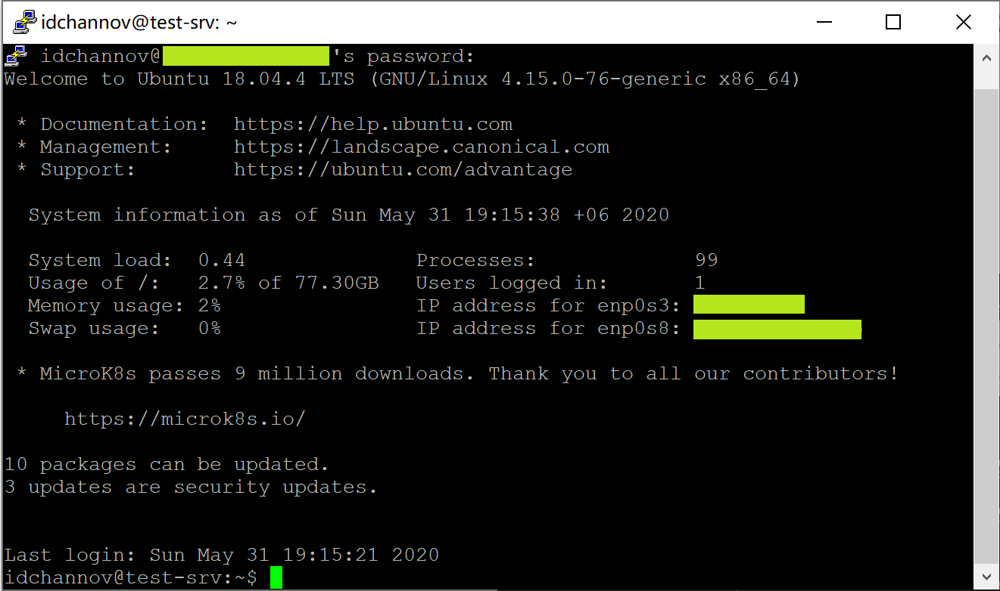

- 配置SSH免密登录 [ [SSH](ShellProgramming/SSH/ssh.sh) ]

  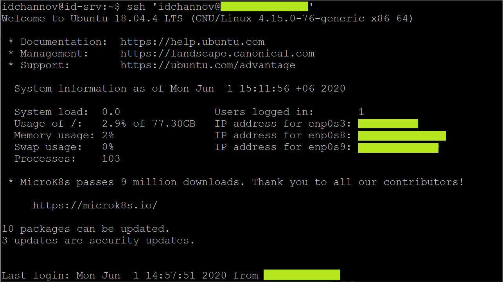

### 4. 实验过程

- **FTP的自动安装与自动配置**

  - 软件选择	`pure-ftpd`

    >Considering the evaluations above, any server would work in a situation, however generally speaking:
    >
    >- If you want a server with the most flexible configuration options and external modules: **pro-ftpd**
    >- If you have just a few users and want a simple, secure FTP server: **pure-ftpd**
    >- If you want to run a FTP server at scale with many users: **vsftpd**

  - FTP服务器配置任务 [ [pure-ftpd](ShellProgramming/FTP/pure-ftpd.sh) ]

    - [x] 配置一个提供匿名访问的FTP服务器，匿名访问者可以访问1个目录且仅拥有该目录及其所有子目录的只读访问权限

      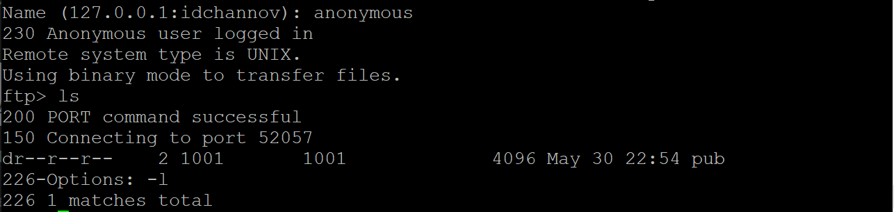

    - [x] 配置一个支持用户名和密码方式访问的账号，该账号继承匿名访问者所有权限，且拥有对另1个独立目录及其子目录完整读写（包括创建目录、修改文件、删除文件等）权限

      - 该账号仅可用于FTP服务访问，不能用于系统shell登录
        
        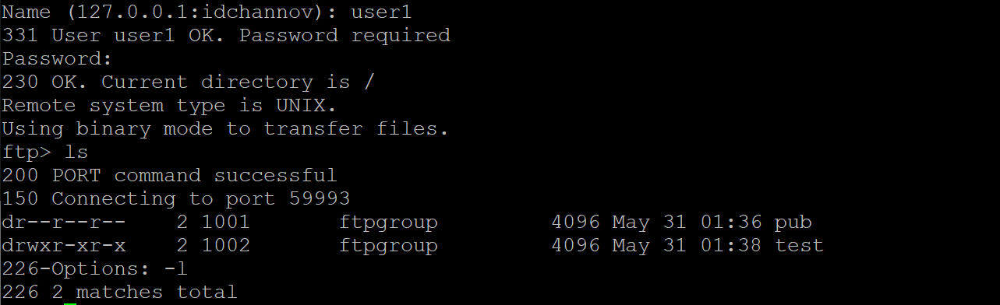
    
        
    
    - [x] FTP用户不能越权访问指定目录之外的任意其他目录和文件    
    
      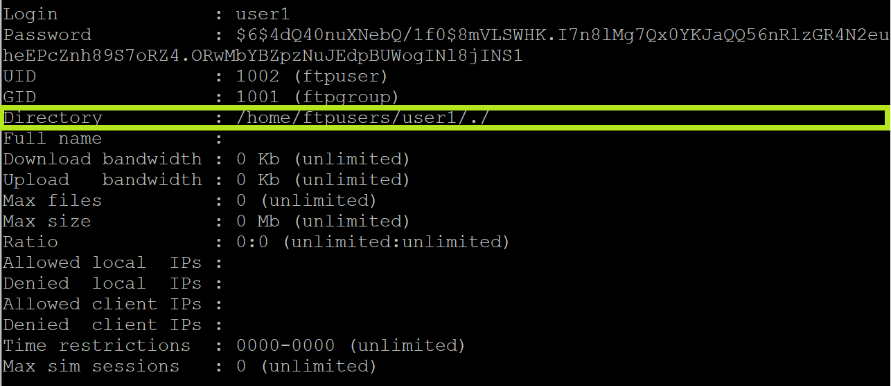
    
    - [x] 匿名访问权限仅限白名单IP来源用户访问，禁止白名单IP以外的访问
    
      pure-ftpd默认将分配给本机的ip作为白名单，仅可设置为--仅限匿名访问/虚拟用户访问
      
      

- **NFS的自动安装与自动配置**

  - 软件选择

    - `rpcbind`  -->  server&client
    - `nfs-kernel-server`  -->  server
    - `nfs-common`  -->  client

  - NFS服务器配置任务 [ [server](ShellProgramming/NFS/nfs_server.sh) | [client](ShellProgramming/NFS/nfs_client.sh) ] [ [config file](conf/NFS) ]

    - [x] 在1台Linux上配置NFS服务，另1台电脑上配置NFS客户端挂载2个权限不同的共享目录，分别对应只读访问和读写访问权限

    - [x] 实验报告中请记录你在NFS客户端上看到的：

      1. 共享目录中文件、子目录的属主、权限信息

         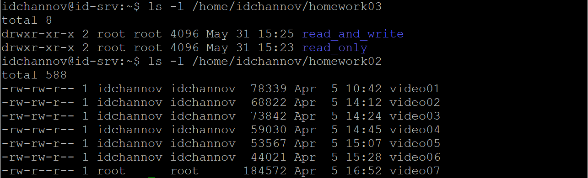

      2. 你通过NFS客户端在NFS共享目录中新建的目录、创建的文件的属主、权限信息
      
         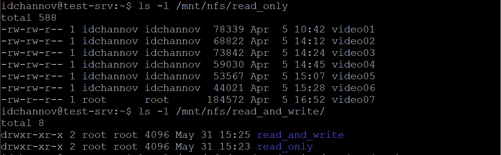
      
      3. 上述共享目录中文件、子目录的属主、权限信息和在NFS服务器端上查看到的信息一样吗？无论是否一致，请给出你查到的资料是如何讲解NFS目录中的属主和属主组信息应该如何正确解读
      
         > **ANS**	一致
      
         > **HOW DOES NFS WORK ?**
         >
         > If a user is attempting to access a file on a UNIX host from a remote NFS client, access to that file will be determined by a combination of individual permissions. When combining the file, directory, and /etc/exports permissions, the most restrictive rights apply to the file.
         >
         > The following example illustrates combined permissions for the user bobr, who is attempting to access the estimates.txt file in the year directory:
         >
         > | **bobr group name:**   | **sales**                                                  |
         > | ---------------------- | ---------------------------------------------------------- |
         > | File permissions:      | -rwxr-x--- 1 bobr jefe 6145 Nov 4 8:14 /year/estimates.txt |
         > | Directory permissions: | dr-xr-xr-- 13 lindac sales 7696 Jan 17 09:13 year          |
         > | /etc/exports entry:    | /year -access=bobr,charleso                                |
         >
         > In this example, bobr is the owner of the estimates.txt file. The owner has rwx permissions.
         >
         > The directory containing estimates.txt (/year) is owned by lindac, but has sales as the group owner. User bobr is a member of the sales group, so his access to the /year directory is determined by the group permissions. In this case, the directory group permissions are r-x.
         >
         > The combined permissions for bobr are r-x.
         >
         > For NFS access, it is necessary to check the /etc/exports file to see if the year directory is being exported, and whether it has any restrictions for access. In this case, the /year directory is being exported with access for users bobr and charleso only.
         >
         > User bobr, therefore, has r-x (read and execute) access to the estimates.txt file in the year directory using NFS. The user can `cd` into this directory, and can read and execute files within the directory. However, he cannot delete, rename, or create any files in this directory.

- **DHCP的自动安装与自动配置**

  - [x] 2台虚拟机使用Internal网络模式连接，其中一台虚拟机上配置DHCP服务，另一台服务器作为DHCP客户端，从该DHCP服务器获取网络地址配置

  - 准备工作

    - 虚拟机网络服务配置（Internal）

      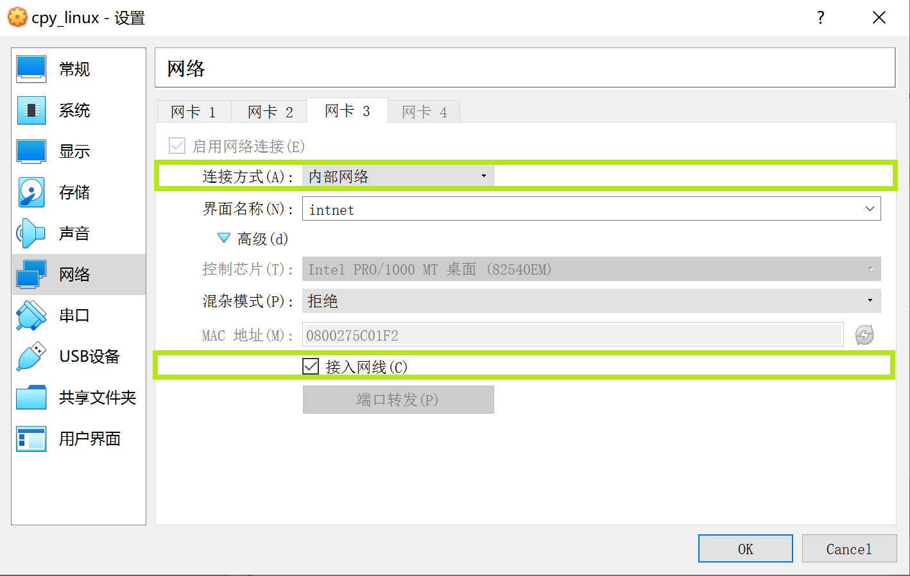

      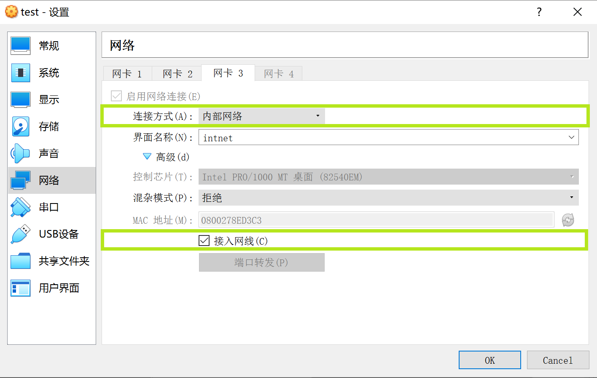

  - DHCP服务配置 [ [server](ShellProgramming/DHCP/dhcp.sh) ] [ [config file](conf/DHCP) ]

    *(client端手动配置Internal网络服务即可，写脚本配置似乎没啥必要lol)
    
    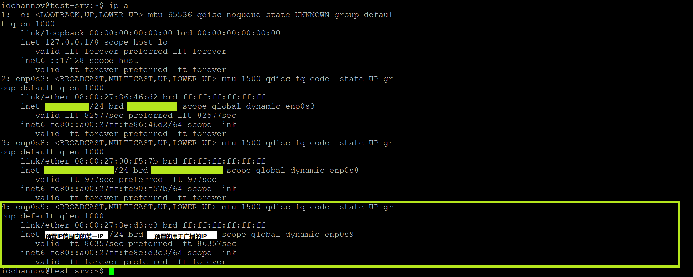

- **Samba服务器配置和客户端配置连接测试**

  - 软件选择
    - `samba`
    - `smbclient`
  - Windows-to-Linux访问配置任务 [ [samba](ShellProgramming/Samba/lin2win.sh) ] [ [config file](conf/Samba) ]

  	- [x] Linux设置匿名访问共享目录(share)

  	- [x] Linux设置用户名密码方式的共享目录(guest)
  	  
      - `Win`+`R`键入`\\idchannov's ip`即可以匿名或用户名+密码的方式访问Linux的共享文件
  	     
         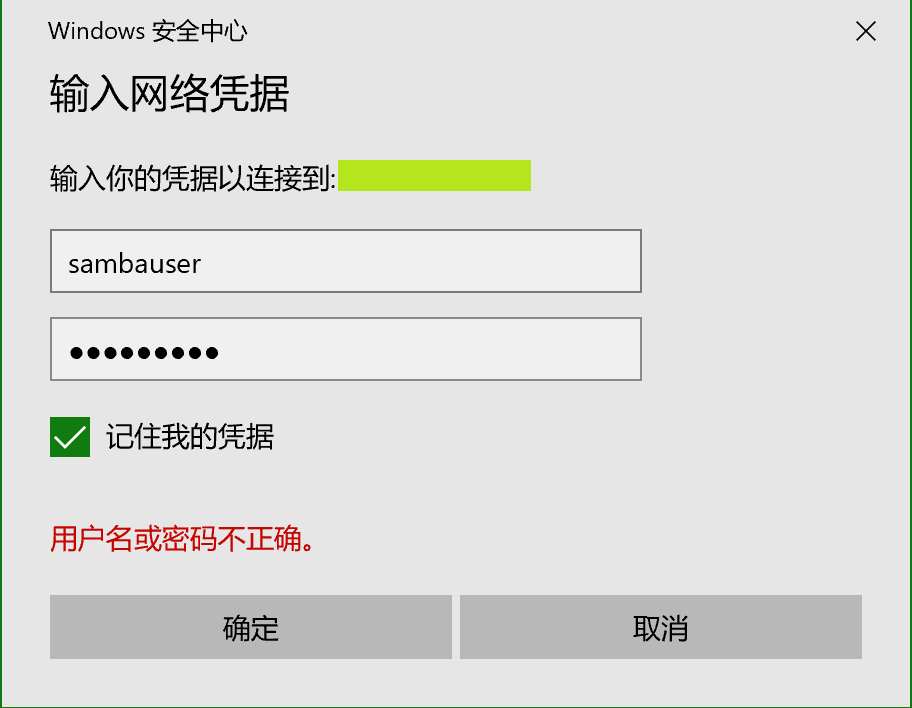
  	
  	    
        
  - Linux-to-Windows访问配置任务
  	- [x] Linux访问Windows的匿名共享目录
      - Windows主机启用网络共享服务

        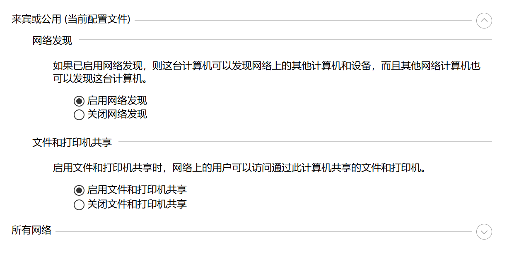

    	- 网络共享权限配置
        
        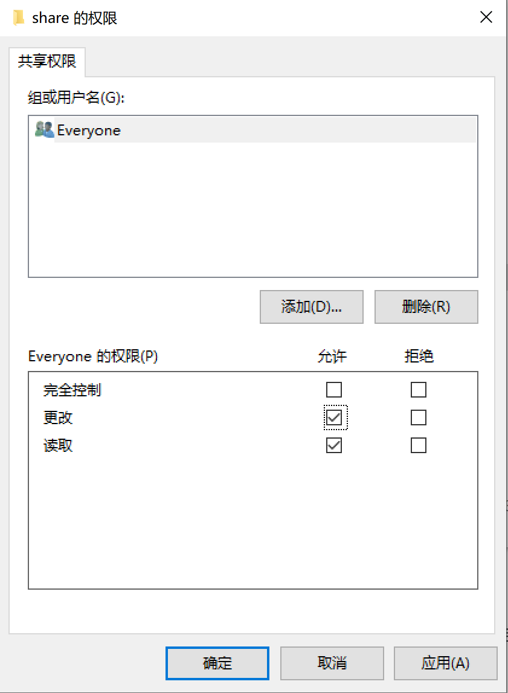

    	- 变更文件夹属主
        
        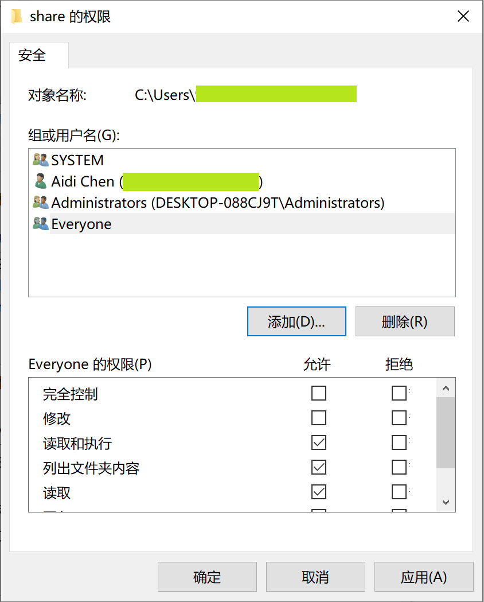

    	- 匿名访问
        
        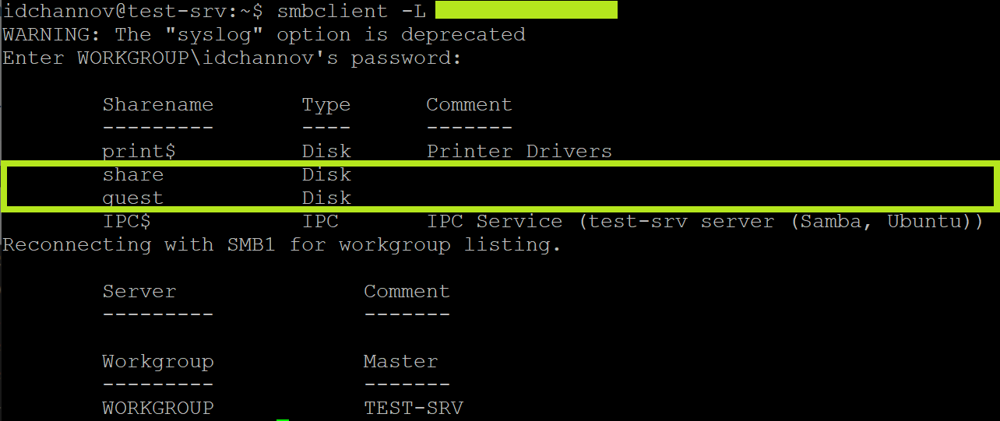

  	- [x] Linux访问Windows的用户名密码方式共享目录

       - 添加用户

         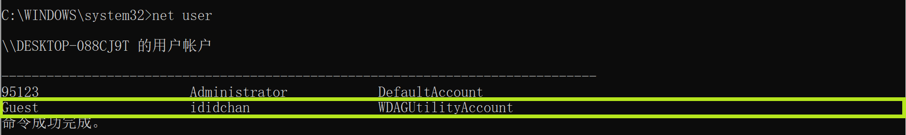

    	 - 网络共享权限配置

         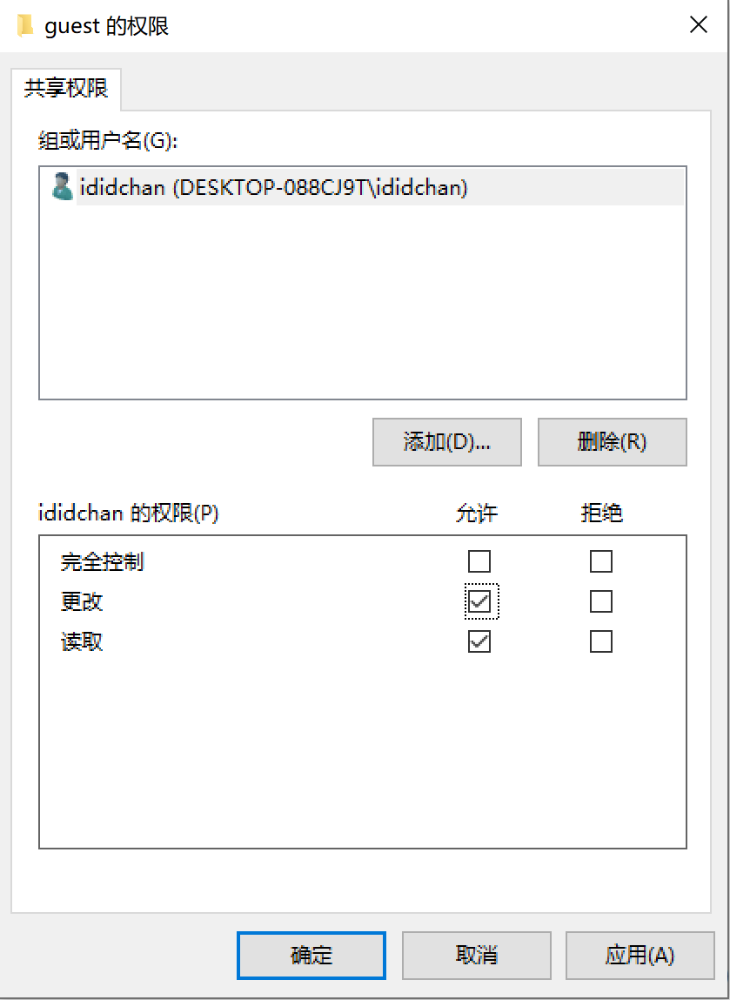

    	 - 变更文件夹属主

         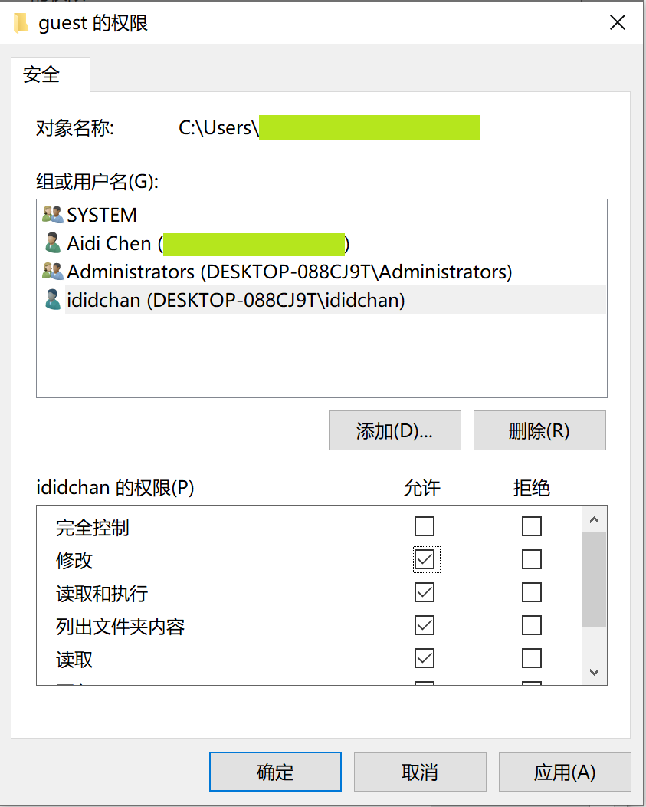

    	 - 用户名+密码访问

         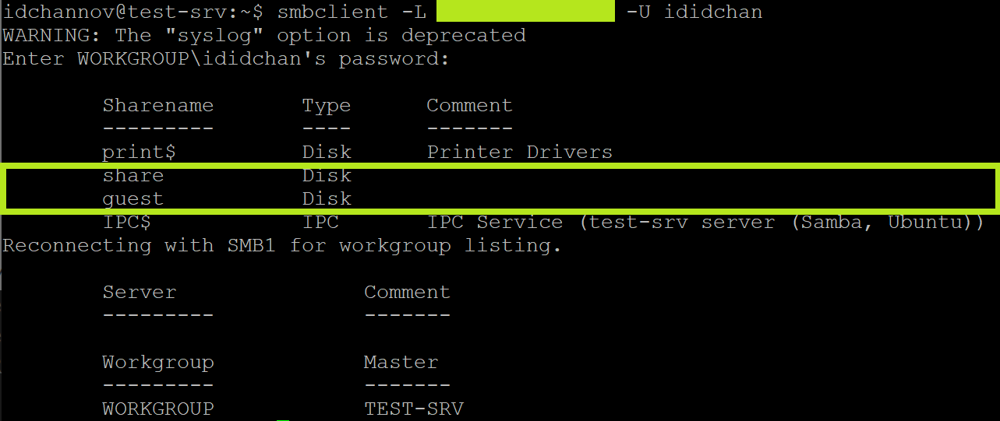

  	- [x] 下载整个目录
      
      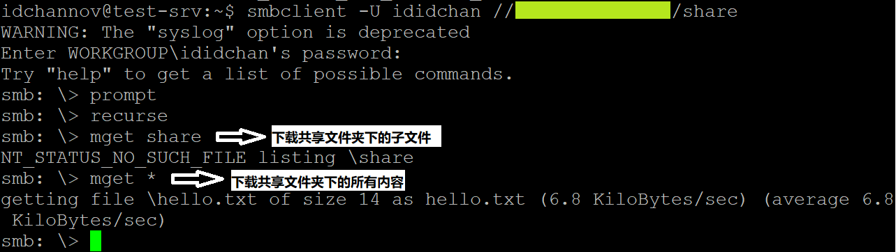
  	  
      

-  **DNS的自动安装与自动配置**

  - 软件选择	`bind9`

    *(若使用`dnsmasq`则DNS配置与DHCP配置可合并，这里由于任务要求选择分步配置)

  - DNS服务配置任务 [ [server](ShellProgramming/DNS/dns_server.sh) | [client](ShellProgramming/DNS/dns_client.sh) ] [ [config file](conf/DNS) ]
    - [x] 基于上述Internal网络模式连接的虚拟机实验环境，在DHCP服务器上配置DNS服务，使得另一台作为DNS客户端的主机可以通过该DNS服务器进行DNS查询
  
      
  
    - [x] 在DNS服务器上添加 `zone "cuc.edu.cn"` 的以下解析记录
  
      ```
      ns.cuc.edu.cn NS
      ns A <自行填写DNS服务器的IP地址>
      wp.sec.cuc.edu.cn A <自行填写第5章实验中配置的WEB服务器的IP地址>
      dvwa.sec.cuc.edu.cn CNAME wp.sec.cuc.edu.cn
      ```

### 5. 遇到的问题及解决办法

- 新建虚拟机时使用多重加载方式添加虚拟硬盘后网卡2的ip地址与工作主机相同

  **解决办法：**修改`/etc/netplan/01-netcfg.yaml`

  ```shell
  network:
    version: 2
    renderer: networkd
    ethernets:
      enp0s3:
        dhcp4: yes
      enp0s8:
        dhcp4: yes
        # add
        dhcp-identifier: mac
  ```

### 6. 参考资料

- [shell expect](https://www.cnblogs.com/yangxinrui/p/11307720.html)
- [Evaluating FTP Servers: ProFTPd vs PureFTPd vs vsftpd](https://systembash.com/evaluating-ftp-servers-proftpd-vs-pureftpd-vs-vsftpd/)
- [pure-ftpd Documentation](https://download.pureftpd.org/pub/pure-ftpd/doc)
- [Pure-ftpd服务安装设置](https://wiki.ubuntu.org.cn/Pure-ftpd服务安装设置)
- [Understanding UNIX and NFS Permissions](https://support.microfocus.com/kb/doc.php?id=7021756)
- [Installing and configuring NFS Server on Ubuntu](https://www.tecmint.com/install-nfs-server-on-ubuntu/)
- [VirtualBox 虚拟机网络连接模式](https://www.jianshu.com/p/a85ba56d16ff)
- [How to configure networking with Netplan on Ubuntu](https://vitux.com/how-to-configure-networking-with-netplan-on-ubuntu/)
- [Step by step guide to setup a DHCP server / client configuration in VirtualBox](https://askubuntu.com/questions/906151/step-by-step-guide-to-setup-a-dhcp-server-client-configuration-in-virtualbox)  -->  answer2
- [Bash Shell 脚本写入多行文字到某文件](https://www.jianshu.com/p/40ff8bdd196c)
- [Ubuntu 18.04安装Samba服务器及配置](https://www.linuxidc.com/Linux/2018-11/155466.htm)
- [How to Share Files Between Windows and Linux](https://www.howtogeek.com/176471/how-to-share-files-between-windows-and-linux/)
- [recursively copy directory with smbclient](https://fordodone.com/2014/03/07/recursively-copy-directory-with-smbclient/)
- [DNS with bind9 and DHCP on Ubuntu 16.04](https://blogging.dragon.org.uk/dns-bind9-dhcp-ubuntu-16-04-2/)
